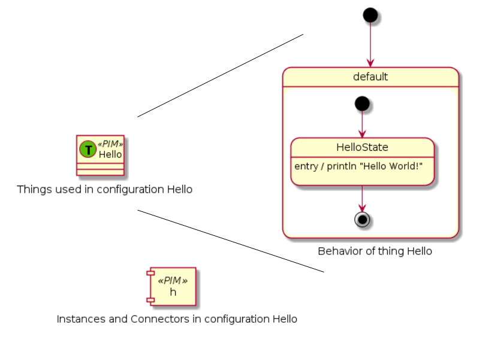

# ThingML language documentation

This document provides an overview of the ThingML language constructs and syntax through some examples.

## Hello World

<div style="float:right; width:50%;text-align:right">

</div>

```
thing Hello {
	
	statechart init HelloState {
		
		final state HelloState {
			on entry println "Hello World!"
		}	
	}
}

configuration Hello {
	instance h : Hello
}
```

