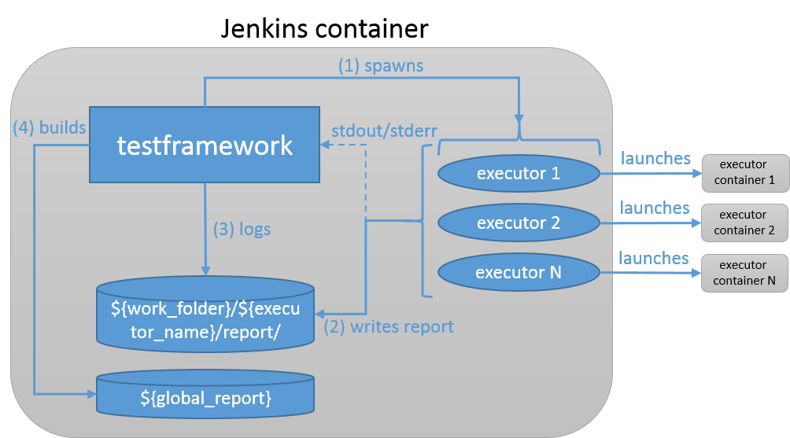
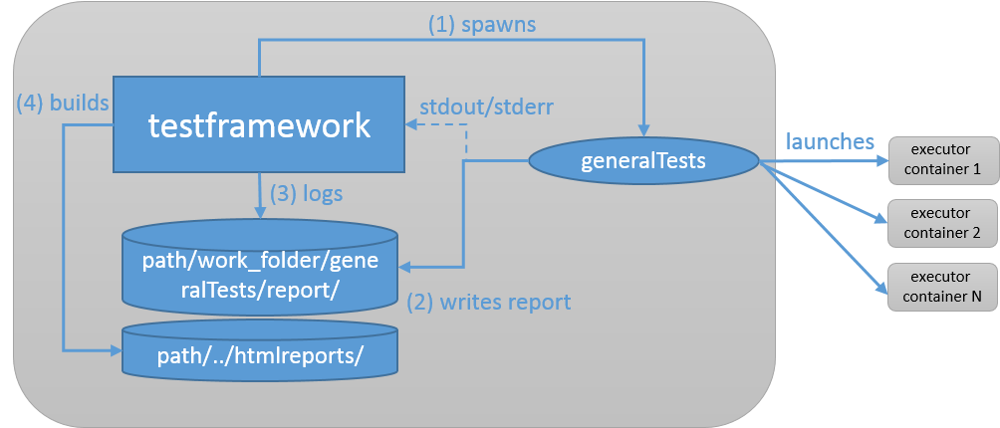

# Jenkins ThingML Test Framework (beta)
## Overview
Jenkins ThingML Test Framework builds ThingML artifacts, runs test cases and publish results. The framework runs inside the Jenkins docker container. However, it does not relay on any Jenkins and therefore, we can run it separately.


The framework executes test cases by delegating testing to dedicated executors. The primary goal is to run executors, wait for the executors to complete and publish accumulated report. An external executors can be any program, which comply to certain criteria. Each executor runs a test suit with a number of test cases. We encourage that an executor runs the test suite in a separate container. The executor has to output to standard outputs (stdout/stderr) and publishes test results in a specific format in the specified folder.

## How to use?
The framework is up and running on the local cloud. `Jenkinsfile` (in the root of the repository) defines the work-flow to execute by Jenkins every time a change is pushed to the ThingML repository. The work-flow builds ThingML, runs the framework and makes results available at `Jenkins > ThingML Testing > ThingML > select branch > select build > Test Execution Report.

## Installation
[Installation instructions](https://github.com/SINTEF-9012/ThingML/blob/master/testframework/docs/installation.pdf)

## Test Framework
### Configuration
`test.py` defines the work-flow which Jenkins initiates if a change in the repository is detected or we trigger the build manually. The configuration file `config.ini` controls the behavior of the framework.
```sh
[general]
test_working_folder=work_folder
global_report_dir = ../htmlreports

[generalTests]
category_name=generalTests
category_test_script=run.py
```
The file `config.ini` splits in sections. The first section specifies global parameters of the framework, e.g. working folder. Following sections describes test suits to be run by executor. Typically, these sections contain the name of the test suite, and the tool which initiates the execution of the test suites. Others parameters are not supported.

The leading section contains two parameters, i.e. `test_working_folder`, `global_report_dir`. The parameter `test_working_folder` (`${work_folder}`) specifies the working folder of the framework. This folder contains all temporary data, e.g. logs, reports, which the framework creates at runtime. `global_report_dir`(`${global_report}`) specifies the location of the final test execution report. This section does not support any other parameters. All paths in this section are relative to the main framework script `test.py`.

The following section `[generalTests]` describes the test suit to execute. The name of the test suite is given in the `category_name` (`${executor_name}`) parameter. The second parameter `category_test_script` specifies the script that initiate the execution of the test suite. The given set up tells us that there is a test suite with the name `generalTests`. The name of the suite specifies the name of the folder where we find the executor script `run.py` that initiates the test case execution. The name of the test suite should match to the name of the test suite folder. The folder of the test suite should be located in the same directory with `test.py`. 

### Test Suite
To execute a test suite the framework spawns an executor for each test suite. In our example, the configuration file contains only one test suite, i.e. `generalTests`. The test framework reads the configuration, locates the folder with the `generalTests` and forks a process using `run.py` which is found in the located folder. In our example, it spawns a new process using the following command line:
```sh
$> run.py <test-suite-name> <test-suite-working-folder> <test-suite-report-folder> 
```
where:
 - `run.py` is taken from `category_test_script` and is an entry point of the executor.
 - The framework uses value of `category_name` to set the parameter `<test-suite-name>`.
 - `<test-suite-working-folder>` is an absolute path to the working folder of the executor, e.g. `/some_path/testframework/<test_working_folder>/<category_name>`.
 - `<test-suite-report-folder>` is an absolute path to the test executor report folder where the executor stores results of the test suite execution. The path has the following format `/some_path/testframework/<test_working_folder>/<category_name>/report`.

### Adding Test Suite
To add a new test suite, one has to create a folder in the test framework root and add a script inside just created folder which launch a test suite execution. Thereafter, we need to add a new section in `config.ini`. 
```sh
[general]
test_working_folder=work_folder
global_report_dir = ../htmlreports

[generalTests]
category_name=generalTests
category_test_script=run.py

[arduinoTests]
category_name=arduinoTests
category_test_script=arduion_test_run.sh
```
The folder structure of the test framework should looks as follows:
```sh
testfolder
└── config.ini
└── test.py
└── generalTests
    └── run.py
    └── ...
└── arduinoTests
    └── arduino_test_run.sh
    └── ...
└── ...
```                   
It is up to executor how to execution of test cases. However, there are two requirements in order to make results available:
 - It should output to standard outputs (stderr, stdout)
 - Results must be saved at `<test-suite-report-folder>`, i.e. `/some_path/testframework/<test_working_folder>/<category_name>/report`. The root folder of the report must have the `<test-suite-name>` name
 - The entry point of the report must be in the html format, and the entry point of the report must be `results.html` file

Therefore, the structure of `<test_working_folder>` must be the following:
```sh
testfolder
└── <test_working_folder>
    └──  arduinoTests
        └──  report
            └──  arduinoTests
                └── results.html
                └── ...
└── arduinoTests
    └── arduino_test_run.sh
    └── ...
└── ...
``` 
The framework copies the contents of `<test_working_folder>/arduinoTests/report/arduinoTests` and uses it to compile the final report in the `<global_report_dir>` directory.

### Explaining Test Suite: `generalTests` 
The figure belows shows a set up of the framework with the `generalTest` suite running.

The executor of the test suite does not run the test suite itself. It load-balances all test cases and delegates their execution to docker containers which the executor builds and launches at runtime. Further, the `generalTests` executor accumulates results from the containers and publishes the report. The executor of the `generalTests` relays on [testJar README.md](https://github.com/SINTEF-9012/ThingML/blob/master/testJar/Custom_Tests_README.md) and `config.ini` sets parameters.
```sh
[runConfiguration]
docker_image_dir = ./dockerfile
docker_image_name = thingml/thingml-general-test-slave:latest
load_balance_util = ./loadbalance.py
test_jar = ../../testJar/target/testJar-1.0.0-SNAPSHOT-jar-with-dependencies.jar
compiler_jar = ../../compilers/registry/target/compilers.registry-1.0.0-SNAPSHOT-jar-with-dependencies.jar
network_plugin_jar = ../../compilers/official-network-plugins/target/official-network-plugins-1.0.0-SNAPSHOT.jar
test_src_folder = ../../testJar/src
loadbalancer_test_config=./testConfig.properties
loadbalancer_lb_config=./loadBalanceTestConfig.properties
```
where:
 - `docker_image_dir` specifies location of `Dockerfile` and the script to execute test cases. This container is build and launched by the `generalTests` executor. `docker_image_name` is the name of the docker image.
 - `load_balance_util` uses testJar to load balance, the config for this balancer is `loadbalancer_lb_config`. [See testJar README.md](https://github.com/SINTEF-9012/ThingML/blob/master/testJar/README.md) 
`test_jar`, `compiler_jar`, `network_plugin_jar` are binaries which are used by testJar to execute test cases. [See testJar README.md](https://github.com/SINTEF-9012/ThingML/blob/master/testJar/README.md)
 - `loadbalancer_test_config` defines test cases to execute. [See testJar README.md](https://github.com/SINTEF-9012/ThingML/blob/master/testJar/README.md) 
