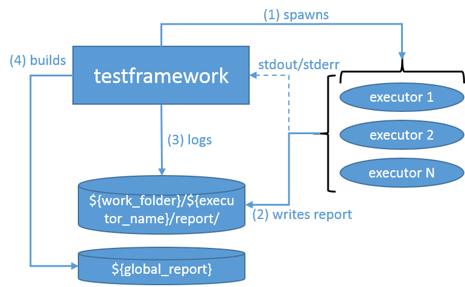

# Jenkins ThingML Test Framework (beta)
## Overview
Jenkins ThingML Test Framework builds ThingML artifacts, runs test cases and publish results. The framework is integrated with Jenkins, but does not require Jenkins to execute test cases and compose test execution reports. The framework does not executute test cases itself, but rather deligates testing to external executors. The primary goal of the framework is to run the test executors and collect results. An external executors can be any program. Each executor runs a test suit which contains of a number of test cases to run. An executor has to output to standard outputs (stdout/stderr) and publishes test results in a specific format in the specified folder. The test framework waits for all executor to complete, collects results and publish the final report.
### Test Framework
The figure below sums up and higlights the workflow and core parts of the framework.

The script `test.py` implements the figure above. Each time we want to execute test cases the script should be run. The configuration file `config.ini` controls the behavior of the framework.
```sh
[general]
test_working_folder=work_folder
global_report_dir = ../htmlreports
[generalTests]
category_name=generalTests
category_test_script=run.py
```
The file `config.ini` splits in sections. The first section specifies global parameters of the framework, e.g. working folder. Following sections describes test suits to be run by executor. Typically, these sections contain the name of the test suite, and the tool which initiates the execution of the test suites. Others parameters are not suported.

The leading section contains two parameters, i.e. `test_working_folder`, `global_report_dir`. The parameter `test_working_folder` (`${work_folder}`) specifies the working folder of the framework. This folder contains all temperary data, e.g. logs, reports, which the framework creates at runtime. `global_report_dir`(`${global_report}`) specifies the location of the final test execution report. This section does not support any othe parameters. All paths in this section are relative to the main framework script `test.py`.

The following section `[generalTests]` describes the test suit to execute. The name of the test suite is given in the `category_name` (`${executor_name}`) parameter. The second parameter `category_test_script` specifies the script that initiate the execution of the test suite. The given set up tells us that there is a test suite with the name `generalTests`. The name of the suite specifies the name of the folder where we find the executor script `run.py` that initiates the test case execution. The name of the test suite should match to the name of the test suite folder. The folder of the test suite should be located in the same directory with `test.py`. 

### Test Suites
To execute test suites the test framework spawns an executor for each test suite. In our example, we have only one test suite `generalTests`. The test framework will read the configuration, locate the folder with the `generalTests` and fork a process using `run.py`. The test framework uses the following command line to spawn a process:
```sh
run.py <test-suite-name> <test-suite-working-folder> <test-suite-report-folder> <non-privileged-user-name> <non-privileged-user-pwd> <ssh-port>  
```
where:
 -   The framework uses value of `category_name` to set the parameter `<test-suite-name>`.
 - `<test-suite-working-folder>` is an absolute path to the working folder of the executor of the following form `/some_path_segement/testframework/${work_folder}/${executor_name}`.
 - `<test-suite-report-folder>` is an absolut path to the test executor report folder where the exectore stores results of the test suite execution. The path has the following format `/some_path_segement/testframework/${work_folder}/${executor_name}/report`
 - `<non-privileged-user-name>` is the name of a non-priviledged user that has access to `<test-suite-working-folder>`
 - `<non-privileged-user-pwd>` is the password of `<non-privileged-user-name>`
 - <ssh-port> is a SSH port

## Usage
## Installation
### Build and Run Jenkins Container
### Set Up Jenkins